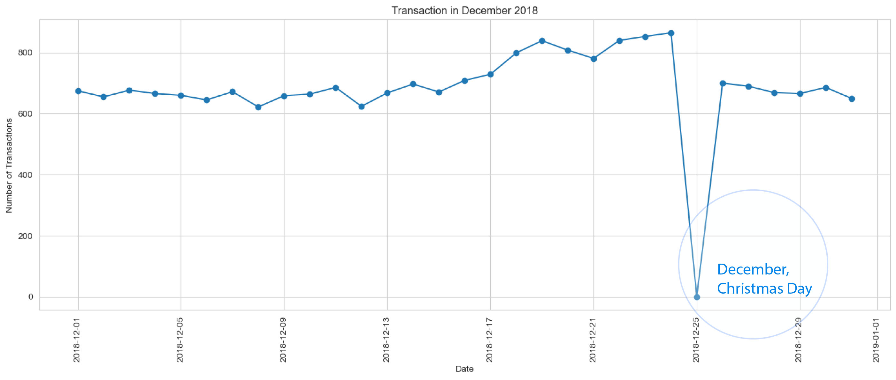

# Quantum Simulation Analysis
 This project was inspired by Quantum Forage,a job simulation that i participated.
 This project's data belongs to a company dealing in selling chips products
 The main goal is to to analyze product sales,proficts and overall performance

## Steps Taken
- Loaded the two data files (Transactional data and Customer data) into vs code
- Cleaned and Converted date column to proper date format
- Ensured data quality by removing non-chip products such as salsa
- Checked and removed outliers,e.g a transaction with over 200 product Quantity was identified and dropped

## Visualization

## key Insights

- Young Singles/Couples and Retirees Contribute most to chip sales.This is most by the Mainstream premium customers
- Pack Sizes of 175 (g) and 150 (g) are the most bought sizes by customers
- There was a single customer who purchased over 200 pack sizes,we decided to remove him as he acted as an outlier 
- The Christmas Date had no transaction.
- Mainstream young singles prefer Kettle, Pringles and Doritos Brands more than others

